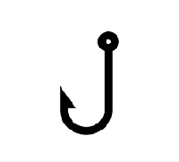
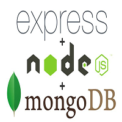
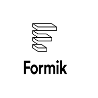
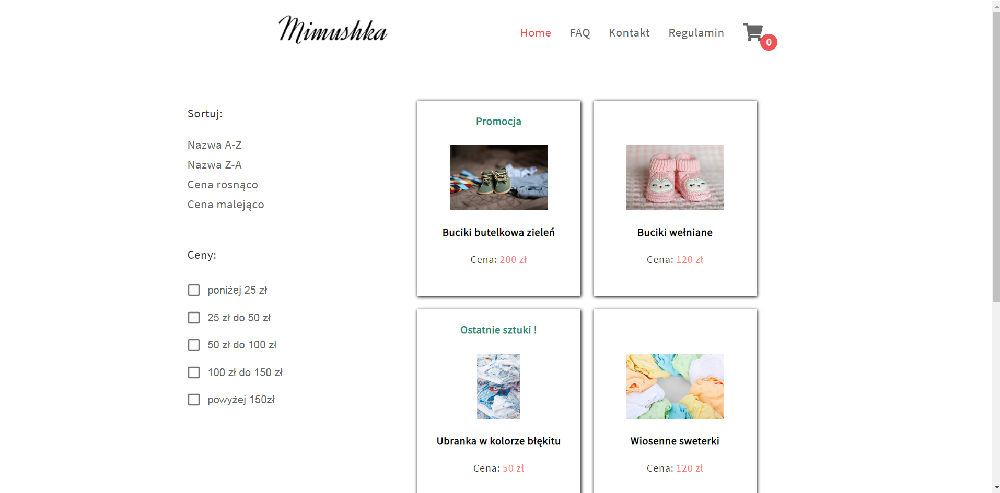
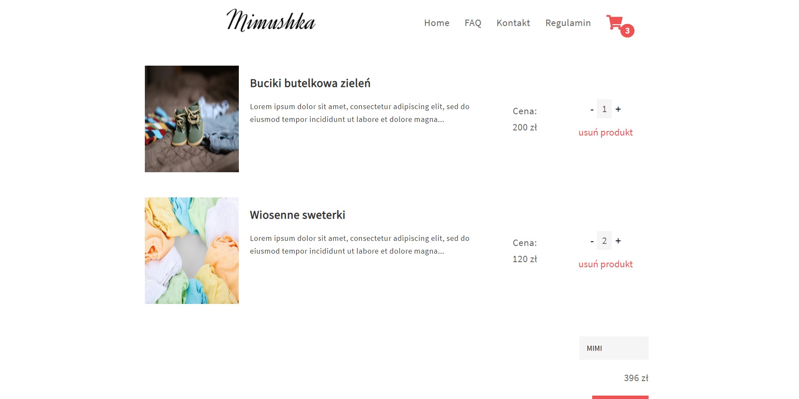
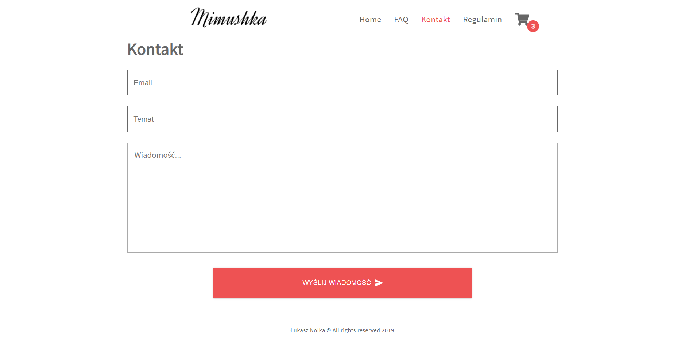
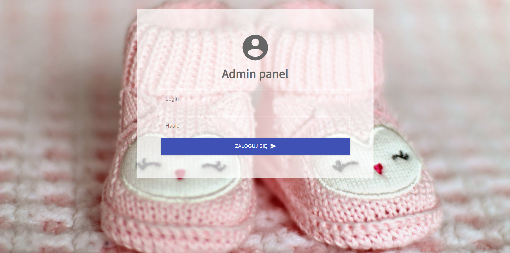

# Mimushka - shop app
MERN app for online shop with client and admin layout. You can add product on shop cart using buttons or Drag & Drop options, use discount code and Admin dashboard add new product, edit or remove existing product. 

# Demo : 
App was deployed on VPS server:

https://mimushka-shop.pl/

# Technologies :
     
 
- React + Redux + Hooks
- Node + express + mongodb + mongo Atlas
- Formik with Yup validation
- CKEditor
- Sass
- Axios
- Nodemailer
- Passport 
- and other...

# Preview

# Tasks :
`yarn install` to install package
`yarn start` to start project 

<b> ENJOY !</b>
